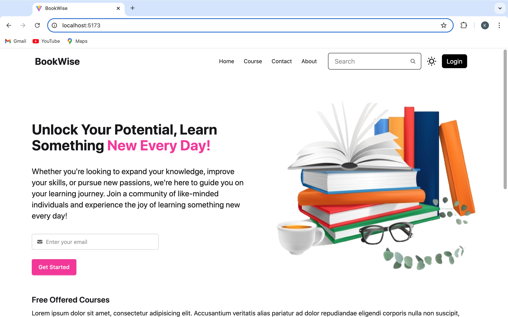
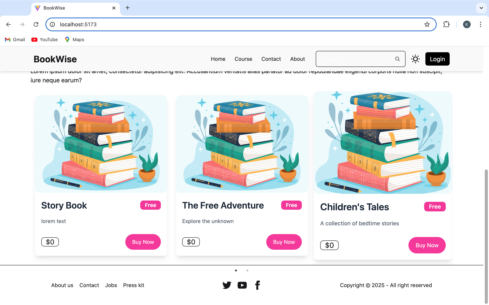
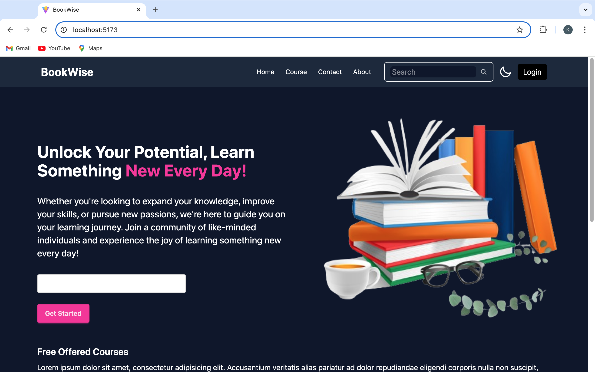

# BookWise
BookWise is a web application designed to help individuals improve their skills and knowledge. It offers a variety of educational courses and resources while fostering a community of learners dedicated to growth and success. Users can sign up, log in, explore courses, contact the team, and enhance their knowledge every day!

## Features
- **User Authentication**: Sign up, log in, and manage accounts securely.
- **Courses**: Access a wide range of educational resources to develop various skills.
- **Light/Dark Mode**: Toggle between light and dark themes for a personalized experience.
- **Course Visibility**: Paid courses are accessible only to logged-in users.
- **Contact Us**: Users can reach out to the support team for inquiries or issues.
- **Responsive Design**: The platform is fully responsive, ensuring seamless usage across all devices.

## Tech Stack
### Frontend:
- **React.js**: JavaScript library for building dynamic user interfaces.
- **Tailwind CSS**: Utility-first CSS framework for modern and responsive layouts.
- **React Router**: Enables client-side routing and seamless navigation.
- **Axios**: Handles API requests efficiently.
### Backend:
- **Node.js**: JavaScript runtime for backend development.
- **Express.js**: Web framework for handling HTTP requests.
- **MongoDB**: NoSQL database for storing user and course data.
- **Mongoose**: MongoDB object modelling tool for working with MongoDB.
- **bcryptjs**: Hashing and securing user passwords.

## Installation
### Prerequisites
1. Node.js installed on your machine.
2. MongoDB for database storage. You can either use a local MongoDB server or a cloud service like MongoDB Atlas.

### Steps to Run Locally:
1. Clone the Repository:
```
git clone https://github.com/kshitij7704/BookWise.git
```
2. Navigate to the Project Folder:
```
cd BookWise
```
3. Install Dependencies for the Frontend:
Inside the frontend directory:
```
cd frontend
npm install
```
4. Install Dependencies for the Backend:
Inside the backend directory:
```
cd backend
npm install
```
5. Set Up Environment Variables:
In the backend directory, change the contents of .env file for the dollowing environment variables:
```
MONGODB_URI=your-mongodb-uri
PORT=400`
```
6. Start the Project:
- Backend
Inside the backend directory, run:
```
npm start
```
The backend should now be running on http://localhost:4001.
- Frontend:
Inside the frontend directory, run:
```
npm run dev
```
The frontend will now be running on http://localhost:5173.

7. Visit the App:
Open your browser and navigate to http://localhost:5173 to see the application in action.

## Usage
- **Sign Up / Login**: Users can sign up, log in, and manage their profiles.
- **Courses**: View available courses and resources that will help enhance your knowledge and skills.
- **Contact Us**: Users can contact the support team using the contact form on the website.

## Screenshots
Here are some previews of the application:

### Home Page


### Courses


### Dark Mode


## Folder Structure
```
/backend
    /model
    /controller
    /route
    .env
    package.json
    index.js

/frontend
    /public
    /src
        /components
        /context
        /courses
        /home
        App.css
        App.jsx
        index.css
        main.jsx
    index.html
    package.json
    vite.config.js
```

## API Endpoints
- **POST /user/signup**: Creates a new user.
- **POST /user/login**: Authenticates and logs in the user.
- **GET /course**: Fetches the list of available courses.
- **POST /contact/submit**: Submits a contact message.

## Contribution
Feel free to fork this project and contribute. Here’s how you can help:

Happy Learning with BookWise! 🚀📚
